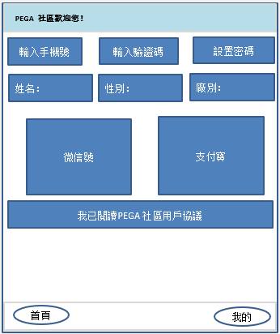
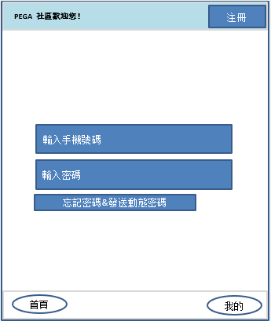
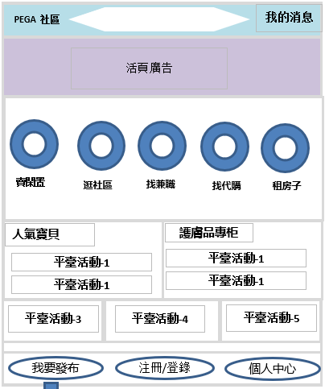
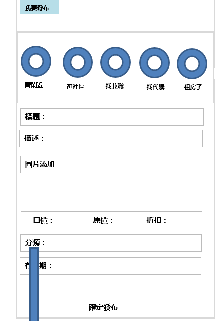
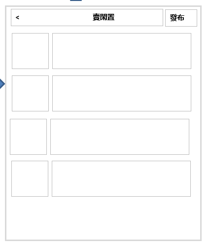
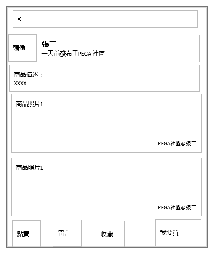

# 信息发布APP 前端页面V1.0

## 项目意义
该项目为论坛形式信息发布平台，
主要功能为发布，浏览帖子，留言等功能。

## 概念
    帖子：由一组图片，字段信息组成的内容块，
    活动，广告，卖闲置，找兼职，等均抽象为贴子。
    
    前端根据需要，为不同类型帖子定制展示，编辑样式。但后端需抽象出来，提供对应增删改查接口。
## 页面规划
根据需求，总共需七个大页面，
* 登陆页面
* 注册页面

* 主页

* 帖子发布页面
* 帖子列表页面
    * 帖子详情子页面
* 个人中心页面

* 广告活动后台管理页面

## 1.注册页面

##### 入口：登陆页面点击注册
* 注册页面功能：输入手机号，密码，短息验证码，性别，姓名信息注册用户
微信支付宝接入[目前不做]
## 2.登陆页面
##### 入口：进入app

* 登陆功能：手机号密码，登陆
* 忘记密码：输入手机号，密码，短息验证码修改密码

## 3.主页
##### 入口：登陆成功

##### 元素及功能：
* 消息数量
    * 点击进入个人主页-消息列表页面，展示几种类型消息，收藏，点赞，留言【见个人中心页面】
* 置顶帖子展示（人气宝贝类）
    * 展示部分点赞数高或若干帖子
* 广告活动展示
    * 展示管理员维护的活动，广告，也视为贴子的一种
* 卖闲置，社区，兼职，代购，租房5大图标
    * 点击进入帖子列表页面，按点击的按钮优先展示对应类别帖子
* 我要发布按钮
    * 点击跳转帖子发布页面

## 4.帖子发布页面
##### 入口：主页-我要发布按钮

##### 元素及功能：
* 卖闲置，找兼职，找代购，租房子，逛社区，五大类图标
    * 点击后下部出现对应结构的编辑界面[由帖子类别属性设计编辑结构]
    * 保存并发布帖子
    * 该页面也将用于发布后的帖子编辑
## 5.帖子列表页面

##### 元素及功能：
* 帖子概要列表，每个帖子大概由 图片一张，标题，等信息组成。点击单个进入详情
    * 帖子详情子页面
    * 帖子主体内容[由帖子类别属性设计展示元素]，及留言输入框，点赞，收藏，操作按钮，
    (1.发帖时设置卖家的信息保护:I.选择请买家联系我.II.买家留言给我,我去联系买家)
    
        
## 6.个人信息页面
##### 入口：主页-个人中心
##### 元素及功能：
    上部显示个人信息，点击可编辑
    中部一个横栏菜单【我的发布】【我的收藏】【我的消息】，点击后下部显示对应内容
    其中我的发布列表下的单个帖子点击后应跳转到发布帖子页面，允许修改[关闭帖子]
    我的收藏则展示收藏的帖子列表（可以考虑将此按钮移到5大类按钮处，直接使用5.帖子列表页面展示）
    我的消息显示被收藏，被点赞，被留言，以及他人点击"我要买"消息
## 7. 广告活动后台管理页面
##### 入口：待定 
 帖子发布页面-管理员版，发布广告活动帖子
（就是帖子发布页面，可发布该类型帖子，管理员可见）

